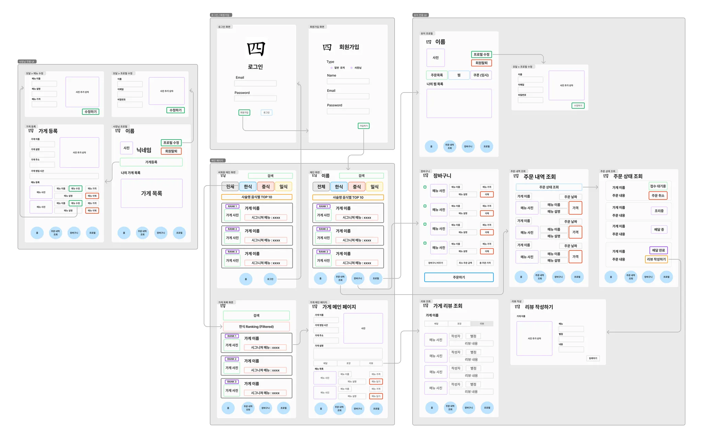
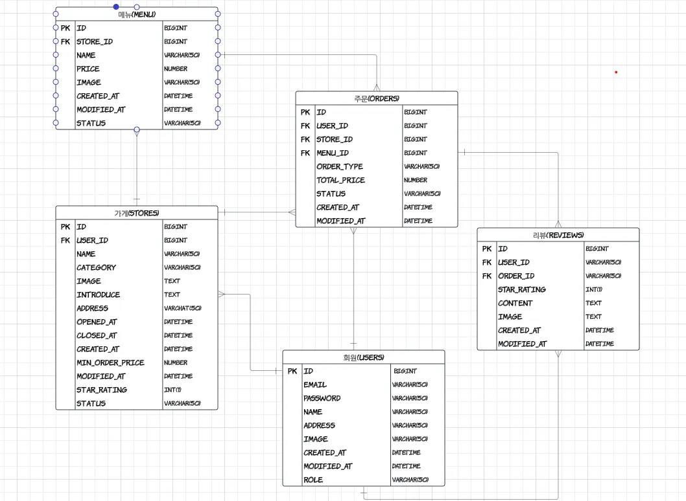
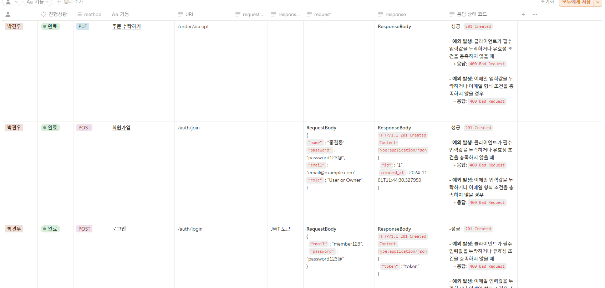

# 내일배움캠프 아웃소싱 프로젝트

## 개발 기간
## 24.11.01 ~ 24.11.07
### :데스크톱_컴퓨터:기술 스택

## 팀원 소개
### 팀장 : 윤영한
### 팀원 : 박견우, 류지수, 유선준, 박인선

## 와이어 프레임

## ERD

## API 명세서

#### 자세한 API가 보고싶다면 클릭 ->  https://www.notion.so/teamsparta/12a2dc3ef51480d4963ad05b870d0ce6

## 주요 기능 소개
### - 회원가입, 로그인 기능 구현
#### 사장님과 일반회원으로 구분하여 각각 다르게 가입하게 구현!
#### JWT 토큰을 헤더에 담아 전달하는 방식 선택

### - 가게 CRUD 기능 구현
#### 가게에 대한 CRUD 권한은 항상 사장님에게만!
#### 카테고리별 가게 전체 조회 가능!
#### 리뷰 많은 순으로 TOP 10 조회 가능!
#### 가게 이미지 추가가능

### - 메뉴 CRUD 기능 구현 
#### 메뉴에 대한 CRUD 권한은 항상 사장님에게만!
#### 메뉴 소프트 DELETE 기능 
#### 메뉴 이미지 추가 기능 가능

### - 주문 CRUD 기능 구현
#### 주문상태 조회 기능 구현!
#### 주문수락시 클라이언트쪽에서 주문상태 확인 가능!

### - 리뷰 CRUD 기능 구현
#### 리뷰는 주문완료된상태에서만 작성가능!
#### 리뷰 별점별 조회 기능 구현!

## 팀프로젝트를 하면서 느낀부분
### - 개개인의 코딩스타일이 다르지만 서로의 의견을 존중하여 선정
### - RESTFUL API 설계 기준이 달라 만은 시간이 소요되었지만 그만큼 수정이 적었음!